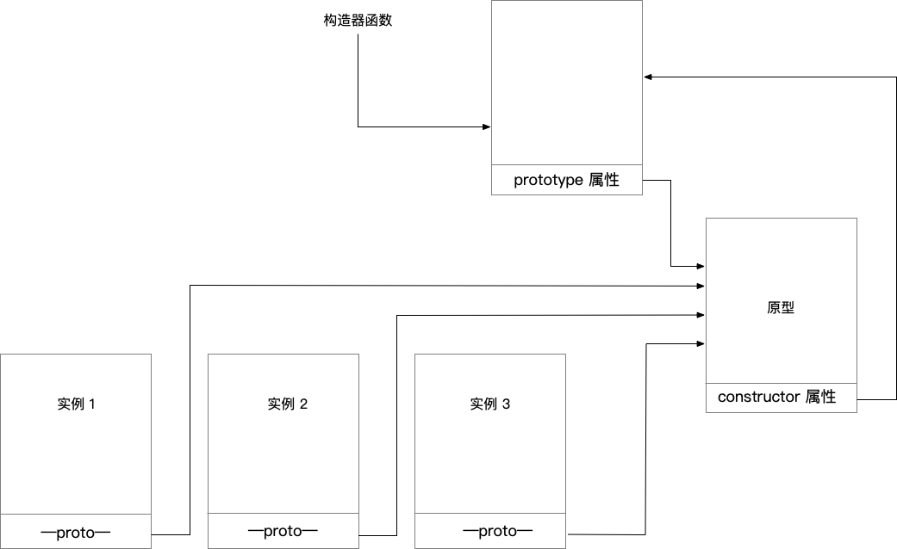

## Javascript 语言精髓 和  编程实践

- Object Oriented Programming

		
		Brandon Myers 第一次 提出 OOP javascript
		
		
		
		
	
	
- runtime

		
		runtime 运行期环境
		
			脚本引擎必须运行在一个宿主之中 并由该宿主创建和维护脚本引擎实例的 "运行期环境" runtime
			
			
		runtime
		
			ECMAScript   DOM   BOM
			
		Javascript untype language
		
		
	
- 作用域

		
		从作用域划分
		
			全局作用域
			
				全局变量
			
			函数作用域
			
				局部变量
				
			块级作用域
			
				局部变量
				

- 数据类型

		
		类型分为
		
			基本类型  元类型 meta types
			
		undefined
		
		null
		
		number
		
		string
		
		boolean
		
		object
		
		
		typeof 检测类型
		
			undefined   number   string   boolean   object   funciton
			
			
		值类型  undefined   number   string   boolean
		
		引用类型   object   funciton
		
		值与引用 值与值 之间 即使等值 == 也不一定全等 ===
		
		两个引用之间如果等值 == 则一定全等 ===
		
		 
		
		
		

- 变量声明

		
		显式声明
		
		
		隐式声明
		
		
		声明
		
			声明类型
			
			声明初值
			
			
		声明类型           直接量声明           包装对象
		
		undefined         undefined          无
		
		string            单引号 双引号        String
		
		number            1234567890         Number
		
		boolean           true false         Boolean
		
		object            null               无
		
		object            {}                 Object
		
		object            []                 Object
		
		object            //                 RegExp
		
		function          function(){}       Function
		
		

- 转义符

		
		用一个反斜线字符 \ 引导
		
		\n  换行符
		
		\r  回车符
		
		当反斜线字符 \ 位于一行的末尾时  用于表示连续的字符串声明
		
		Null String
		
			用一对不包含任意字符的单引号或双引号来表示一个空字符串  Null String
			
			空字符串 与 其他字符串 一样可以用对象成员名
			
			var Obj = {
				'': 100
			
			}
			
			console.log(Obj[''])
		
		
		
	
- 函数声明

		
		function functionName () {}
		
		如果省略 functionName 就是 匿名函数 anonymous function
		
		形式参数
		
			是指可以在函数体内部使用的 有效的标识符名
			
		实际参数
		
			arguments 是函数体内使用内部对象存取调用中传入的实际参数
			
		子函数
		
			如果在函数内部 声明的函数 就是 子函数
			
			子函数 其实 主函数 的局部变量
			
		
		在当前作用域中 表达式中具名函数识别为匿名函数 而忽略它的函数名
		
				(function foo() {
				    console.log("foo");
				});
				
				console.log(foo); // ReferenceError: foo is not defined
		
		表达式 由 运算符 与 运算元 构成
		
		运算元 包括 变量  函数的返回值  直接量  
		
		单值表达式
			
			javascript 可以 存在 没有运算符 的表达式 称为  单值表达式
			
				this
				
				变量引用
				
				直接量  null undefined 字符串  布尔值  数值  正则表达式 
				
				
		()  表达式运算符
		
		
		
	
- 等值检测

		
		相同 不相同 === !==   考虑 数据类型
		
		相等 不相等 == !=
		
		
		相等 == != 规则:
		
			1. 两个值类型进行 比较  
			
				转换成相同数据类型的值进行 比较
				
			2. 值类型 与 引用类型 比较
			
				将引用类型的数据 转换为 值类型数据相同的数据 再比较
				
			3. 两个引用类型比较
			
				比较引用地址
				
			
		相同 === !== 规则:
		
			两个值类型进行比较
			
				数据类型不同  则必然 不相同
				
				数据类型相同 进行数值等值 比较
				
			值类型 与 引用类型 比较
			
				必然 不相同
				
			两个引用类型比较
			
				比较引用的地址
				
			
		总结
		
			在对两个引用类型的比较运算过程中  ==  与 === 并没有任何的不同
			
		
		NaN没有序列值 任何值 与 NaN 进行序列检测将得到 false
		
		
	
- void

		
		void 运算表达式并忽略值
			
		void 避免表达式返回值
		
		使表达式总是返回值 undefined
		
		
		
			
	
- 函数调用

		
		函数本身是变量/值  因此函数调用其实是一个表达式
		
		
		没有引用的匿名函数的调用方法
		
		1(function3(){
			// ...
		}2());
		
		第一个 括号  是强制运算符  返回调用结果
		
		第二个 括号  是函数调用运算符
		
		第三个 括号  是函数参数表占位符
		
		
		没有引用的匿名函数的调用方法
		
		1(function3(){
			// ...
		})2();
		
		第一个 括号  是强制运算符  返回函数自身的引用
		
		第二个 括号  是函数调用运算符
		
		第三个 括号  是函数参数表占位符
		
		没有引用的匿名函数的调用方法
		
		void function(){
			// ...
		}();
		
		void 将 后面的 function(){}() 看做 函数表达式 
		
		而 void作用 就是 运算表达式 并忽略 返回值
		
		() 和 void 运算将函数声明变成 "(直接量的)单值表达式"
		
		void function(){
			// ...
		}(1，2);   // 声明函数立即执行该函数
		
		
		
		
		
	
- 异常语句

		
		触发异常  throw
		
		捕获异常  try catch
		
		结束处理  try finally
		
		
		try {
			return;
			break;
		}finally {
			
		}
		
		上面代码 虽然有return break 但是 finally里面的语句依然会在return break之前执行
		
		
		
		
	
- 对象

		
		1. new  constructor  + this
		
			在构造器函数执行过程中 Javascript将传入new运算所产生的实例
			
			并以该实例作为函数上下文环境中的this对象引用
			
			在构造器函数内部 就可以通过 修改或者添加this对象引用的成员 来完成对象构造阶段
			
			的 初始化对象实例
		
			语法中 当参数表为空 与  没有参数表  是一致的
			
			new Constructor === new  Constructor()
			
			
			如果向 new 后面的函数不作为构造器  而只是作为函数调用
			
				function foo() {
					
					var that = this;
					
					return {}
					
					or
					
					return new Object()
				
				}
		
				var obj = new foo();
				
				
			注意 使用这种方法时候 只能通过return返回一个引用类型的直接量 或 对象实例
			
				如果返回 值类型数据时候 如 true false 1 'abc'... 
				
				脚本引擎会忽略掉它们 仍然使用原来的this引用
				
			
				
	
- 在对象中使用属性读写器

		
		getter / setter
		
			get propertyName(){}
		
			set propertyName(){}
		
		是不使用function 关键字 而是 get set
		
		
		
		
		
	
- 存取运算符

		
		. [] 都是 存取运算符
		
		所不同是 前者右边的运算元必须是一个标识符
		
		后者中间的运算元可以是变量 直接量 或 表达式
		
		. 要求运算元是标识符 因此对一些不满足标识符命名规则的属性 就不可以使用
		
		

- delet

		
		不能删除 var声明的变量
		
		不能删除 直接继承原型的成员
		
		
		delete运算事实上是删除了实例的成员表中的值与描述符
		
		delete 不能通过实例来删除原型的 以及  父类的成员
		
		
		delete仅在删除一个不能删除的成员 才会 返回 false
			
			console.log(delete Object.prototype); // Object.prototype 是禁止删除的
			
			不能删除的成员有
			
			  Function对象 length prototype arguments 
		
		而其他情况:
		
			删除不存在的成员
			
			继承自父类 或 原型的成员
			
		都返回 true	
		
		delete删除宿主对象的成员时 也可能存在问题
		
		
		
	
- in 解决 存在的问题

		
		var propertyNames = [0, '', [], false, undefined, null];
		
		var obj = {
		    '': undefined,
		    '0': false,
		    'undefined': null,
		};
		
		function _in(obj, prop) {
		    if (obj[prop]) return true;
		    return false;
		}
		
		//console.log(_in(obj, 'myProperty'));  // undefined
		
		for (let i = 0; i < propertyNames.length; i++) {
		    //console.log(typeof propertyNames[i]);
		    console.log(_in(obj,propertyNames[i]));
		}
		
		总结：
		
			如果一个属性存在 但是属性值是 0, '', [], false, undefined, null
			
			如果通过 _in 方法 判断 返回 false
			
		改进:
		
			思路
			
				去不存在的属性返回值 是 undefined 因此 typeof运算来检查该值 一定是 undefined 字符串
				
				typeof (obj.property) !== 'undefined'
				
				
		所以 最后 用 in	
		
	
- instanceof

		
		instanceof 将类的继承关系
		
		
	
- 可枚举性

		
		Object.prototype.propertyIsEnumerable()
		
		只检测对象非继承属性 就是非原型链继承而来的
		
	
- 默认对象指定

		
		with语句 提供指定默认对象
		
		如果不提供 就是宿主程序在全局指定的默认对象 浏览器默认是window
		
		with(object )
		{
			...code
		
		}
		
		
		
	
- 严格模式

		
		“use strict”
		
		指示前缀  directive prologue
		
			在全局代码开始处 加入
			
			在eval代码开始处 加入
			
			在函数声明代码开始出 加入
			
			在new Function所传入的body参数块开始出 加入
			
		严格模式的限制:
			
			1. 实在对象直接量声明中 存在相同的属性名
			
			2. 在函数声明中 参数表中带有相同的参数名
			
				在非严格模式中 将会传入指定个数的参数 但在代码中访问同名的参数时 只有最后一个声明是有效的
				
			
			3. 不能声明或重写 eval 和 arguments 这两个标识符
			
			4. 使用0前缀声明的八进制直接量
			
			5. 用delete删除显示声明的标识符 名称 或 具名函数
			
			6. 使用保留字
			
			7. 在代码中使用with语句
			
		
		
	
- 运算符的二义性

		
		,               连续运算符              参数分隔符 对象 数组声明分隔符
		
		;               空语句  语句分隔符
		
		
		
		
	
- 语言

		
		语言分为
		
			命令式语言
			
			函数式语言
			
			逻辑式语言
			
			面向对象语言
			
		命令式语言的演化分为  结构化编程  和  面向对象编程
		
		结构化
		
			控制结构
			
			组织结构
			
			数据结构
			
		所谓控制结构
		
			顺序
			
			分支
			
			循环
			
		所谓组织结构
		
			表达式
			
			语句行
			
			过程 
			
			单元
			
			包
			
		所谓数据结构
		
			基本数据结构
			
			复合数据结构
			
				是由基本数据结构按复合规则构成
				
		命令式语言的核心
		
			通过运算去改变内存中的数据
			
		
		
		
	
- 语法作用域

		
		信息隐藏
		
			指的是 变量成员的 可见性 问题
			
		作用域
		
			这个可见性的区间 则依赖于 语法的陈述 这称之为  作用域
			
		作用域 包括 语法作用域  和  变量作用域  两个部分
		
		Javascript 作用域
		
			函数作用域
			
			全局作用域
			
		
	
- 面向对象

			
		封装 多态  继承
		
		继承 实现方案
		
				基于类     class-based
				
				基于原型   prototype-based
				
				基于元类   metaclass-based
				
		空对象 null  与 空的对象
		
		javascript中 空的对象 是 整个原型继承体现的根基
		
		javascript中 空对象 null 是 作为一个保留字存在的 
		
		null 不是 空的对象 而是代表 这样一个对象
		
			属于对象类型
			
			对象是空值
			
		null对象
		
			没有属性
			
			没有方法
			
			没有原型
			
			并不是自object()构造器或其子类实例而来
			
			null instanceof Object // false
			
		
		
		所谓 空的对象  也称为 裸对象  空白对象
		
			就是一个标准的 通过Object()构造的对象实例
			
			obj = {}  // 空的对象
			
			空的对象 只有 预定义的 属性  和 方法
			
			
			
	
- 原型继承的基本

			
		对象 没有 原型
		
		构造器 有 原型
		
			构造器属性"<构造器>.prototype" 指向 原型
			
		对象 只有 构造自某个原型 并存在 持有或拥有 某个原型
			
		原型本身就是一个对象实例
		
		原型的含义是指
		
			如果构造器有一个原型对象A 则由该构造器创建的实例 都 必然 复制  A
			
			
		Object()构造器的原型 是 一个空的对象
			
	

- 原型复制

	
			
		1. 构造复制
		
		2. 写时复制
		
		3. 把写赋值的粒度从原型变成成员
		
			仅当写某个实例的成员时 将成员的信息复制到实例映像中
			
			这样一来 在初始构造该对象时候
			
			规则1  保证在读取时被首先访问到
			
			规则2  如果对象中没有指定属性  则尝试遍历对象的整个原型链  直到原型为空null或找到该属性
			
			
	

- 构造过程

		
		函数只有需要引用到原型时 才具有构造器的特性
		
		函数原型 总是  一个标准的 系统内置的 Object()构造器实例
		
		该实例创建后constructor属性总线被赋值为函数
		
		对象实例 本质
		
			是 一个指向原型的 并持有一个属性列表的结构
			
		
		
		Object.prototype.__proto__ // null
		
		Object.getPrototypeOf(Object.prototype)  // null
		
		
		
	
- 函数具有特殊成员

		
		call
		
		apply
		
		bing
		
		arguments   // 实参对象  伪数组
		
		length   // 函数形参的个数
		
		prototype  // 对象
		

- 原型链

		 
		一个实例至少应该拥有指向原型的proto属性 这是javascript中对象系统的基础
		
		不过这个proto属性是不可见的 称之为 内部原型链
		
		和 构造器的 prototype 所组成的 构造器原型链 这就是通常说 原型链
		
		内部原型链是Javascript的原型机制所需要的
		
		通过constructor 与 prototype 所维护的构造器原型链 则是用户代码要回溯时才需要的
		
		
		function a() {  }
		
		function b() {  }
		
		b.prototype = new a();
		
		// b.prototype.constructor = b;
		
		let c = new b();
		
		console.log( c instanceof b)  // true
		
		console.log( c instanceof a)  // true
		
		console.log( c.constructor)  // a
		
		console.log( c.constructor.prototype) // {constructor:b}
		
		
		
		SpiderMonkey 提供了一个默认 在任何创建对象上添加一个 名为 __proto__ 的属性
		
		该属性 总是 指向 构造器所用的原型
		
		
		 __proto__ 变相 公开了 内部原型链上 对象.proto 成员
		 
		 
		
	
	
- 构造对象五种方法

		
		
		1. 使用构造器创建对象实例
		
			function Animal() {
			
				this....
			
			}
		
		
		2. 构造器中直接返回对象实例
		
			funcction Animal() {
				
				var data = this;
				
				return {
				
				
				}
			
			}
		
		3. 修改原型
		
			prototype.propertyname 
			
			
		4. 重新原型
		
			prototype = {
				
				propertyname1:
			
			}
		
		
		5. 继承原型
		
			prototype = new ParentClass();
			
		
		
	
	
- javascript对象

			
		typeof
		
			值类型
			
				undefined
				
				number
				
				boolean
				
				string
				
			引用类型
			
				object
				
				function
				
			
	
- 属性状态维护

		
		preventExtension       不能添加新属性
		
		seal                   不能 添加新属性  删除既有属性
		
		freeze                 不能 添加新属性  删除既有属性  属性只读
		
		
		keys()                 取对象自有的 可见的  属性名数组
		
		getOwnPropertyNames()  取对象自有的属性名数组
		
		   
		
		
		
	